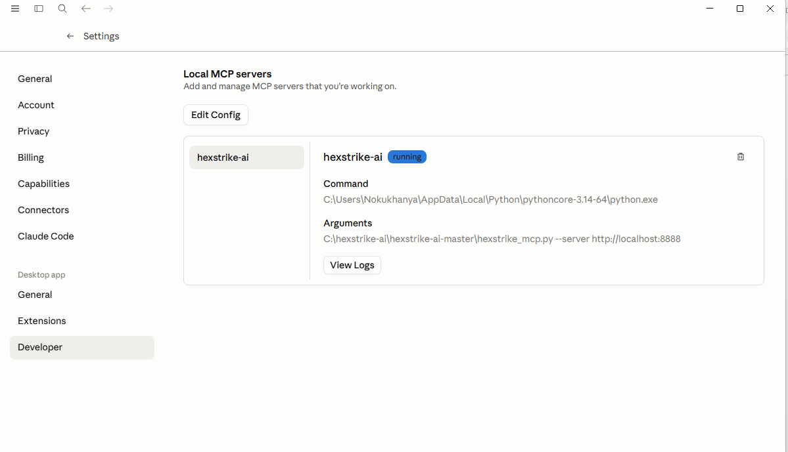
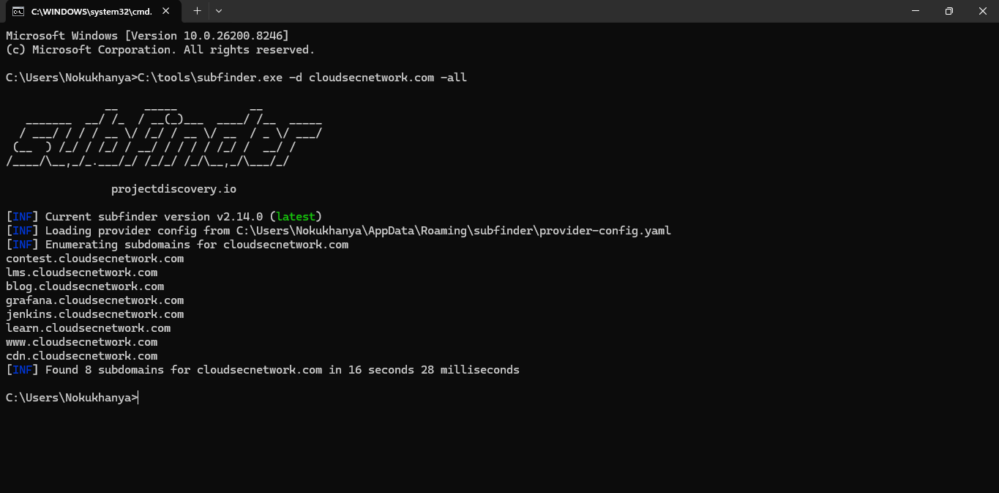
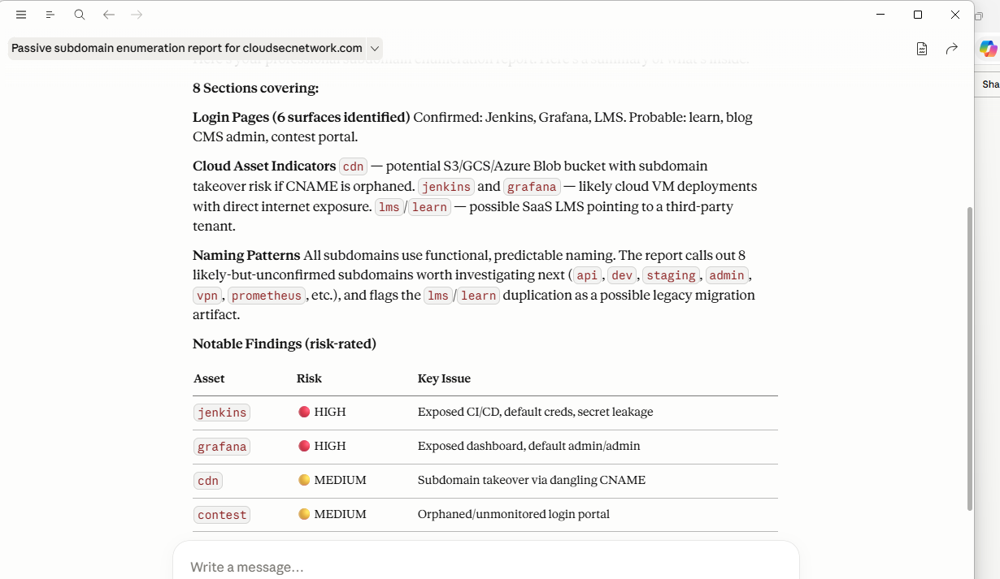

# HexStrike AI — Subdomain Recon & Risk Analysis Tool

## Overview
An AI-powered reconnaissance tool that enumerates subdomains and generates detailed, risk-rated security reports using a custom MCP server connected to Claude AI.

##  Tools & Technologies
- Subfinder
- Claude AI
- MCP Protocol
- Python
- Claude Desktop

##  How It Works
1. Runs Subfinder to passively enumerate subdomains
2. Feeds results into Claude AI via custom MCP server
3. AI analyses attack surface and identifies risks
4. Generates structured risk-rated security report

## Evidence 
1. MCP Server Setup — hexstrike-ai MCP server running and connected. 
2. Subfinder Scan — 8 subdomains passively enumerated in ~16 seconds. 
3. AI-Generated Risk Report — Claude analyzes the attack surface and produces a structured, risk-rated report (2 HIGH, 2 MEDIUM findings identified). 

##  Sample Findings
| Asset | Risk | Issue |
|---|---|---|
| jenkins | HIGH | Exposed CI/CD, default creds |
| grafana | HIGH | Exposed dashboard |
| cdn | MEDIUM | Subdomain takeover risk |
| contest | MEDIUM | Orphaned login portal |

## Skills Demonstrated
- Passive Reconnaissance
- Attack Surface Mapping
- Custom MCP Server Development
- Vulnerability Identification
- AI-Powered Security Reporting

